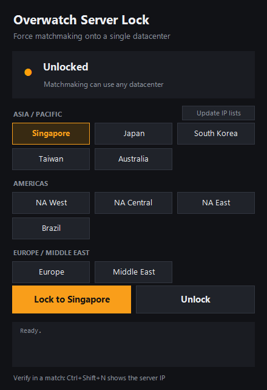

<p align="center">
  
</p>

<h1 align="center">Overwatch Server Lock</h1>

<p align="center">
  Force Overwatch 2 matchmaking onto a single datacenter (Singapore, Tokyo, Seoul, Taiwan, Sydney, Middle East)
  using scoped Windows Firewall rules. One small exe, dark UI, one click to lock or unlock.
</p>

---

> [!WARNING]
> **Beta.** This is an early version. Locking can break Battle.net login (`Time out communicating with
> Battle.net services`) if your account signs in through a server that sits inside a blocked region.
> If that happens, see [Login broken?](#login-broken) below, or
> [open an issue](../../issues/new) with your account region and what you saw.

## Why

Overwatch 2 picks a datacenter from a latency probe before each match. In regions with several nearby
datacenters (SEA, East Asia, Middle East) you can end up on a server that is technically "close" but plays
worse for you, and there is no in-game option to choose.

Overwatch Server Lock blocks every datacenter except the one you pick. The probes to the others time out,
so matchmaking can only place you on the region you chose.

## How it works

1. Downloads the current Overwatch 2 datacenter IP lists maintained by the community
   ([foryVERX/Overwatch-Server-Selector](https://github.com/foryVERX/Overwatch-Server-Selector)).
2. Subtracts the ranges of the region you keep, plus the Battle.net login and patch endpoints
   (resolved via DNS at lock time) so sign-in keeps working.
3. Creates inbound and outbound Windows Firewall block rules, scoped to `Overwatch.exe` only.
   Other apps that happen to use the same Google Cloud regions are not affected.
4. Registers a scheduled task (`OverwatchServerLock-Refresh`, runs as SYSTEM every 2 minutes) that
   re-resolves the Battle.net login hosts. Their IPs rotate; when a new address block shows up, the rules are
   rebuilt from the cached lists so login keeps working. Previously seen login blocks stay open for 7 days.

No game files are touched, nothing is injected, and no drivers are installed. Unlock removes every rule
and the scheduled task. Settings, cached lists and `refresh.log` live in `%ProgramData%\OverwatchServerLock`
(writable by administrators only, since SYSTEM runs the script from there).

## Download and use

1. Grab `OverwatchServerLock.exe` from the [latest release](../../releases/latest).
2. Close Overwatch.
3. Double-click the exe and accept the UAC prompt (firewall rules need admin).
   SmartScreen may warn because the exe is unsigned: **More info** then **Run anyway**.
4. Pick a region and click **Lock**.
5. Start Overwatch and queue. In a match, press `Ctrl+Shift+N` to see the server IP and confirm.
6. Click **Unlock** when you are done, or before grouping with friends who play on other servers.

Rules and the login IP refresh persist across reboots until you unlock.

## Command line

The exe is a thin launcher around two PowerShell scripts in [`src/`](src). You can use the core script directly:

```powershell
.\src\ow-lock.ps1 -On                   # lock to Singapore (default)
.\src\ow-lock.ps1 -On -Keep Japan       # lock to another region (regex on list names)
.\src\ow-lock.ps1 -On -DryRun -Verbose  # preview the ranges, change nothing
.\src\ow-lock.ps1 -On -NoAutoRefresh  # lock without the login IP refresh task
.\src\ow-lock.ps1 -Status
.\src\ow-lock.ps1 -Off                # remove rules and refresh task
```

`-GamePath` overrides auto-detection of `Overwatch.exe` (Steam and Battle.net installs are found automatically).

## Login broken?

Battle.net login servers live inside the same cloud ranges as game servers. The lock keeps the known ones
reachable (`us/eu/kr.actual.battle.net`, version/patch servers), but your region may use another host.
These login hosts also **rotate IPs**. The auto-refresh task follows them, but it runs every 2 minutes, so
right after a rotation login can fail briefly: wait a couple of minutes and retry, or click **Lock** again.

**Quick workaround:** click **Unlock**, log in, click **Lock** again, then queue. Already-open connections
are not cut, so you stay signed in.

**Permanent fix:** keep the login host for your region reachable:

```powershell
.\src\ow-lock.ps1 -On -AllowHost 'kr.actual.battle.net', 'some.other.host'
```

`-AllowHost` hosts are re-resolved by the refresh task too. Or add it to `$ServiceHosts` at the top of [`src/ow-lock.ps1`](src/ow-lock.ps1) and rebuild the exe.
To find which host is failing: unlock, start Overwatch, and while it logs in run

```powershell
Get-NetTCPConnection -OwningProcess (Get-Process Overwatch).Id | Select RemoteAddress, RemotePort
```

then check those IPs against the blocked ranges with `-DryRun -Verbose`. Please
[open an issue](../../issues/new) with the host so it can be added for everyone.

## Caveats

- **Lists go stale.** Blizzard moves and adds servers. Each lock pulls fresh lists; if you start landing on the
  wrong region again, the upstream lists need updating.
- **Longer queues** are possible, since you only match with players on one datacenter.
- **Groups:** if your party leader is placed on a blocked datacenter you will fail to connect. Unlock first.
- **VPNs:** normal full-tunnel VPNs and WireSock-based split tunnels (e.g. TunnlTo) keep the lock working.
  Some gaming accelerators that proxy traffic through their own process can bypass it.
- **Use at your own risk.** This only uses the built-in Windows Firewall and does not modify the game, but
  it is not endorsed by Blizzard.

## Build from source

Requires only Windows (uses the .NET Framework C# compiler that ships with it):

```bat
build.cmd
```

Output: `dist\OverwatchServerLock.exe`. The icon is generated by [`assets/make-icon.ps1`](assets/make-icon.ps1).

```
src/ow-lock.ps1     core: fetch lists, compute ranges, manage firewall rules
src/ow-gui.ps1      WinForms dark UI, runs the core on a background runspace
src/launcher.cs     exe that unpacks the scripts to %TEMP% and starts the UI
src/app.manifest    requests admin on launch
```

## Credits

Datacenter IP lists: [foryVERX/Overwatch-Server-Selector](https://github.com/foryVERX/Overwatch-Server-Selector).

## License

[MIT](LICENSE). Overwatch and Battle.net are trademarks of Blizzard Entertainment, Inc. This project is not
affiliated with or endorsed by Blizzard.
